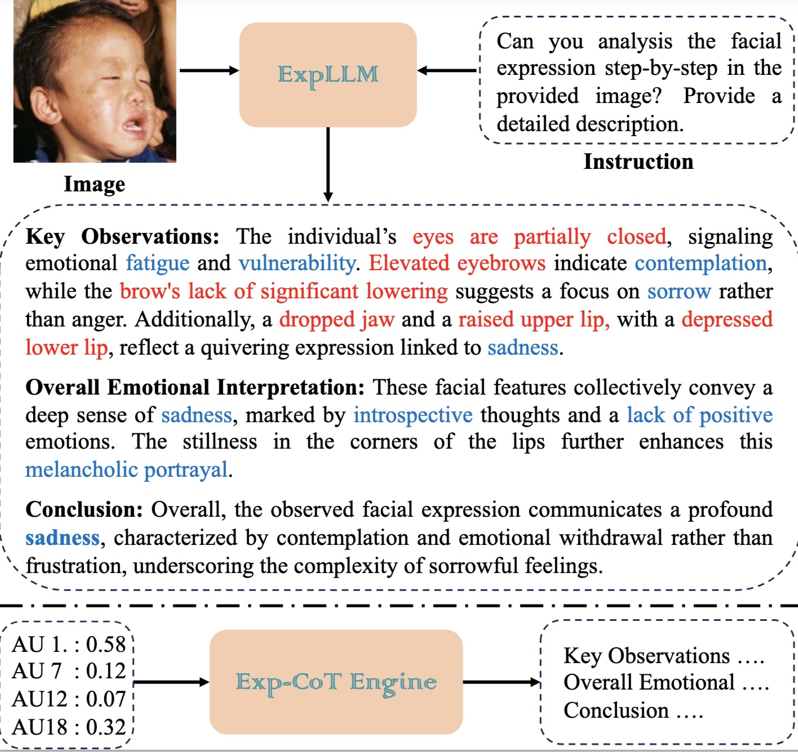

# ExpLLM: Towards Chain of Thought for Facial Expression Recognition

[[`arXiv`](https://arxiv.org/abs/2409.02828)][[`Paper`](https://ieeexplore.ieee.org/document/10948346)]

> [ExpLLM: Towards Chain of Thought for Facial Expression Recognition](https://starhiking.github.io/ExpLLM_Page/)  
> Xing Lan, Jian Xue, Ji Qi, Dongmei Jiang, Ke Lu and Tat-Seng Chua
> IEEE TMM 2025



## Installation

### 1. Clone code
```shell
    git clone https://github.com/starhiking/ExpLLM_TMM
    cd ./ExpLLM_TMM
```
### 2. Create a conda environment for this repo
```shell
    conda create -n ExpLLM python=3.10
    conda activate ExpLLM
```
### 3. Install CUDA 11.7 (other version may not work)
```shell
    conda install -c conda-forge cudatoolkit-dev
```
### 4. Install PyTorch following official instruction (should match cuda version)
```shell
    conda install pytorch==2.0.1 torchvision==0.15.2 pytorch-cuda=11.7 -c pytorch -c nvidia
```
### 4. Install other dependency python packages (do not change package version)
```shell
    pip install pycocotools
    pip install opencv-python
    pip install accelerate==0.21.0
    pip install sentencepiece==0.1.99
    pip install transformers==4.31.0
```
### 5. Prepare dataset
Download RAF-DB and AffectNet-Kaggle from website and put the zip file under the directory following below structure, (xxx.json) denotes their original name.

```
./data
|── coco
│   └── annotations
|   |   └──coco_train.json(person_keypoints_train2017.json)
|   |   └──coco_val.json(person_keypoints_val2017.json)
|   └── images
|   |   └──train2017
|   |   |   └──000000000009.jpg
|   |   └──val2017
|   |   |   └──000000000139.jpg
├── HumanArt
│   └── annotations
|   |   └──validation_humanart.json
|   └── images
|   |   └──2D_virtual_human
├── mpii
│   └── annot
|   |   └──valid.json
|   |   └──gt_valid.mat
|   └── images
|   |   └──000001163.jpg
```
## Usage

### 1. Download trained model

```shell
    git lfs install

    git clone https://huggingface.co/d0ntcare/LocLLM

    mkdir checkpoints
    mkdir checkpoints/ckpts
    mv LocLLM/coco checkpoints/ckpts
    mv LocLLM/h36m checkpoints/ckpts
    # for training
    mkdir checkpoints/model_weights
    mv LocLLM/pretrained/dinov2_vitl14_pretrain.pth checkpoints/model_weights
    # clone vicuna1.5
    cd checkpoints/model_weights
    git clone https://huggingface.co/lmsys/vicuna-7b-v1.5
```

### 2. Evaluate Model
Change `IDX` option in script to specify the gpu ids for evaluation, multiple ids denotes multiple gpu evaluation.

```shell
    # evaluate on coco val set
    bash scripts/valid_coco.sh
    # evaluate on h36m set
    bash scripts/valid_h36m.sh
    # evaluate on humanart set
    bash scripts/valid_humanart.sh
    # evaluate on mpii set
    bash scripts/valid_mpii.sh
```

### 3. Train Model

```shell
    # train on coco
    bash scripts/train_coco.sh
    # train on h36m and mpii
    bash scripts/train_h36m.sh
```

Note that GPU memory should not be less than 24GB.


## Citations
If you find this code useful for your research, please cite our paper:

```
@ARTICLE{lan2025expllm,
  author={Lan, Xing and Xue, Jian and Qi, Ji and Jiang, Dongmei and Lu, Ke and Chua, Tat-Seng},
  journal={IEEE Transactions on Multimedia}, 
  title={ExpLLM: Towards Chain of Thought for Facial Expression Recognition}, 
  year={2025},
  volume={27},
  number={},
  pages={3069-3081},
  doi={10.1109/TMM.2025.3557704}}
```

## Contact me
If you have any questions about this code or paper, feel free to contact me at lanxing19@mails.ucas.ac.cn.

## Acknowledgement
The code is mainly encouraged by [LocLLM](https://github.com/kennethwdk/LocLLM), [Pink](https://github.com/SY-Xuan/Pink) and [LLaVA](https://github.com/haotian-liu/LLaVA). 